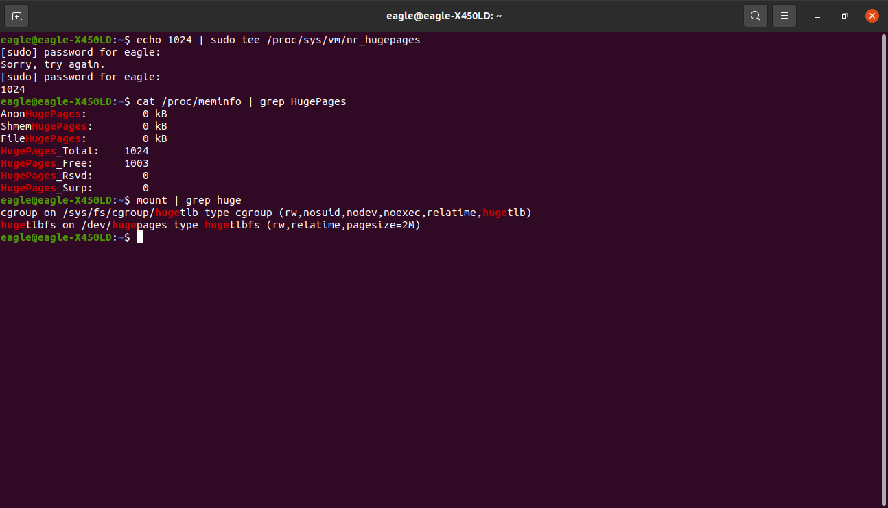
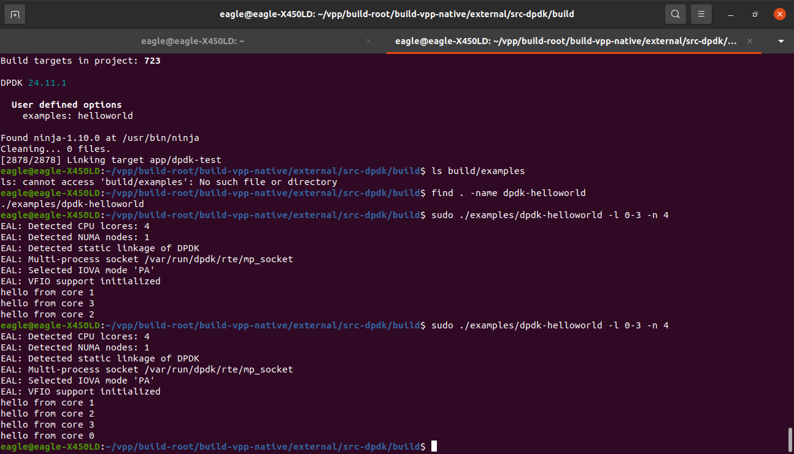

# DPDK Project: Setting Up and Running the helloworld Example

This repository contains the setup and execution of the **helloworld** example using the Data Plane Development Kit (DPDK) within a VPP (Vector Packet Processing) environment. This report outlines the steps, challenges faced, solutions applied, results achieved, and system specifications.

## Prerequisites

To replicate this project, the following tools and dependencies were installed:

* **Ubuntu 20.04 LTS** (or compatible Linux distribution)
* **DPDK** (integrated within VPP source code)
* **Meson** (version 1.8.0 or higher)
* **Ninja** (version 1.10.0 or higher)
* **Dependencies**: `libnuma-dev`, `libpcap-dev`, `python3-pyelftools`, `ninja-build`, `python3-pip`

These were installed using:

```bash
sudo apt update
sudo apt install libnuma-dev libpcap-dev python3-pyelftools ninja-build python3-pip
```

## System Specifications

The project was executed on the following system:

```bash
Architecture: x86_64
CPU op-mode(s): 32-bit, 64-bit
Byte Order: Little Endian
Address sizes: 39 bits physical, 48 bits virtual
CPU(s): 4
On-line CPU(s) list: 0-3
Thread(s) per core: 2
Core(s) per socket: 2
Socket(s): 1
NUMA node(s): 1
Vendor ID: GenuineIntel
Model name: Intel(R) Core(TM) i7-4500U CPU @ 1.80GHz
CPU MHz: 1000.000
CPU max MHz: 3000.0000
...
```

## Steps to Set Up and Run helloworld

### 1. Configuring HugePages

HugePages were allocated to provide large, contiguous memory pages for DPDK. A total of 1024 HugePages (2 GB) were configured.

```bash
sudo sysctl -w vm.nr_hugepages=1024
```


Result: The system successfully allocated 1024 HugePages, verified using:

```bash
cat /proc/meminfo | grep HugePages
```

### 2. Setting Up the DPDK Build Environment

The DPDK source code was located at `/home/eagle/vpp/build-root/build-vpp-native/external/src-dpdk`. The helloworld example was built using Meson and Ninja:

```bash
cd /home/eagle/vpp/build-root/build-vpp-native/external/src-dpdk
rm -rf build
meson setup build
cd build
meson configure -Dexamples=helloworld
ninja
```

Result: The build process created the `dpdk-helloworld` executable in `build/examples/`.

### 3. Running the helloworld Example

The example was executed on CPU cores 0-3:

```bash
sudo ./build/examples/dpdk-helloworld -l 0-3 -n 4
```

Result: The example ran successfully, printing "hello" from each core (0 to 3).



## Challenges and Solutions

### 1. Outdated Meson Version

* **Issue**: The initial Meson version (0.53.2) was incompatible.
* **Solution**:

  ```bash
  pip3 install --user meson --upgrade
  echo 'export PATH="$HOME/.local/bin:$PATH"' >> ~/.bashrc
  source ~/.bashrc
  ```
* **Outcome**: Compatibility issue resolved.

### 2. Missing helloworld Executable

* **Issue**: After running `ninja`, the executable was missing.
* **Solution**:

  ```bash
  cd /home/eagle/vpp/build-root/build-vpp-native/external/src-dpdk
  rm -rf build
  meson setup build
  cd build
  meson configure -Dexamples=helloworld
  ninja
  ```
* **Outcome**: Rebuild successfully generated the executable.

### 3. PATH Configuration for Meson

* **Issue**: Installed Meson was not in system's PATH.
* **Solution**: Added `$HOME/.local/bin` to PATH (see Solution above).
* **Outcome**: Correct version of Meson used.

## Conclusion

This project successfully configured HugePages and ran the DPDK helloworld example on CPU cores 0-3. Challenges were resolved through version upgrades and rebuilds. The DPDK environment is confirmed operational.

## References

* [DPDK Documentation](https://doc.dpdk.org)
* [Memif Guide](https://doc.dpdk.org/guides/nics/memif.html)
* VPP Source Code: `/home/eagle/vpp`
